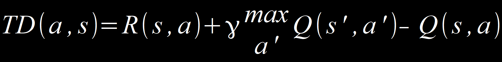
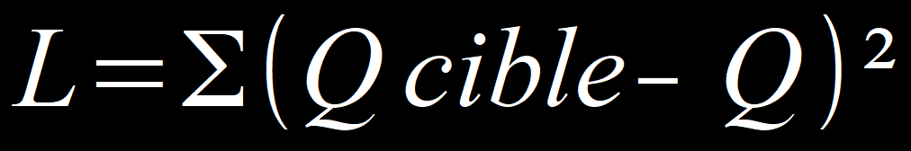

# **Deep Q-Learning**

## **Comment ça marche ?**

Le deep-Learning demande à l'agent de se mettre dans chaque état pour connaître leur valeur et c'est inadapté quand il y a beaucoup de paramètres à considérer.  

À la place, on peut coder les états (par exemple avec 2 dimensions, X1 et X2). Si X1 et X2 = 1 alors l'agent est sur la première case en bas à gauche. Tandis que, si X1 = 1 et X2 = 2 ; l'agent est à la deuxième ligne de la première colonne.  
Quand il y a peu d'état, on pourrait encoder chaque état comme étant 1 ou 0 et avoir 12 possibilités en entrées.  
On parle d'entrées, car chaque va état va en entrée du réseau de neurones, à la sortie, on obtiendra les prédictions. C'est-à-dire, Q1, Q2, Q3, Q4, etc qui sont toutes les actions possibles pour chacune des entrées.  
Le deep Q-learning sert à résoudre les environnements complexes.  

Pour mettre à jour à chaque déplacement la valeur `Q(s,a)`, l'équation de Belmann qui prend la récompense de l'action `a` dans l'état `s` `R(s,a)` auquel on ajoute max `a'` grâce aux valeurs de `Q` de `s'` et a' que l'on connaît déjà pour aller vers l'arrivée multiplier par le facteur de réduction.  
Si on remplace `Q(s,a)` par l'équation de Belmann, ça change trop vite donc, c'est très instable. C'est pour ça que la différence temporelle est utilisée afin d'en ajouter une fraction.  

En deep Q-learning, il n'y a pas vraiment d'avant et d'après.  
Les valeurs sont comparées aux valeurs précédemment calculées (Q1, Q2, etc.) et comme d'habitude dans un réseau de neurones, l'agent calcul une fonction de coût.

Ici, la somme des Q cibles (les vraies valeurs), auquel est soustraite la nouvelle prédiction, le tout au carré.  
Pour minimiser la fonction de coût, il y a la retropropagation pour mettre à jour les poids sur les synapses de l'intérieur de l'ANN afin de faire des meilleures prédictions au fur et à mesure.  

## **Mais comment ce passe la prise de décision ?**

Les résultats `Q` passent dans une fonction `Softmax` pour prendre l'action.  

___
> Cf.  
[Simple Reinforcement Learning with Tensorflow (Part 4)](https://medium.com/@awjuliani/simple-reinforcement-learning-with-tensorflow-part-4-deep-q-networks-and-beyond-8438a3e2b8df "Apprentissage par renforcement simple avec Tensorflow (Partie 4)") by Arthur JULIANI (2016)