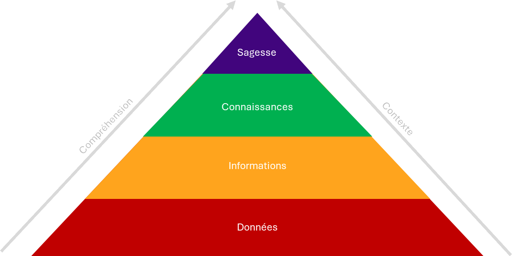
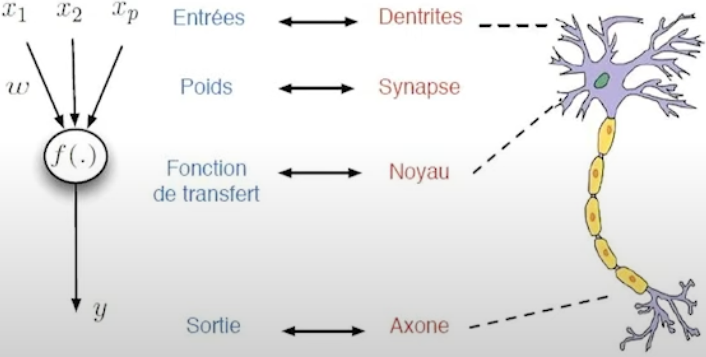
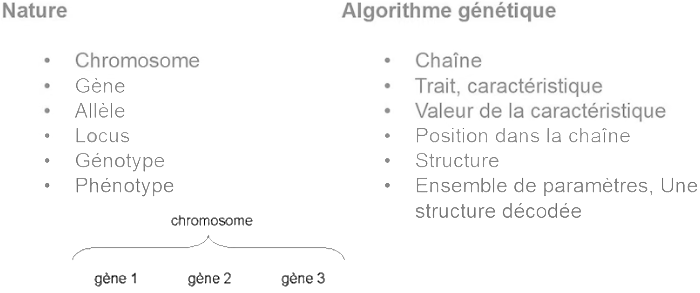

# **Quelques concepts pour comprendre ce qu'est l'IA**

## **Le concept d'intelligence**
Il est difficile d'avoir une définition universelle dans tous les contextes. Nonobstant, il y a des points communs.  

L'intelligence se manifeste par la capacité de conceptualiser le monde réel.  
C'est-à-dire que l'humain se construit une représentation mentale de ce qu'il observe afin de pouvoir agir, prendre des décisions et résoudre des problèmes.  
C'est une capacité à saisir des connaissances et d'apprendre.  
Et, de ce fait, une capacité à appliquer ces connaissances à différentes situations pour résoudre des problèmes.  
Puis, la capacité à communiquer. Ce qui est essentiel pour se comprendre et pouvoir échanger des connaissances dans le but d'apprendre et progresser.

## **Le concept d'artificiel**
Celon le Larousse : Produit par le travail de l'Homme et non par la nature.  

À l'origine, il y a une création qui n'est pas naturelle.  
On peut se dire que l'homme crée une machine qui créée autre chose.  
<h2><b>Les intelligences d'artificielles  
<br>Et qu'est-ce-qu'elles partagent ?</b></h2>
Derrière ce concept, le projet est de construire des artefacts intelligents. C'est-à-dire que quelque chose qui n'est pas naturel doit démontrer des capacités d'intelligence.

En résumé, elle va permettre d'agréger, de percevoir, de raisonner, de communiquer et d'agir.  
La construction reflète l'aspect d'ingénierie (construire dans un projet un artefact).  

L'IA est au service de l'Homme pour lui faire gagner de temps sur un ensemble de tâches qui lui demandent de l'énergie de réflexion et d'intelligence.  

Différentes dimensions (principalement quatre), mais deux principales approches  

<div align="center">

| | **Performances humaines** | **Performances idéales**  
--:|:-:|:-:
**Raisonnement** | Systèmes qui pensent comme des humains | Syes qui pensent rationnellement
**Comportement** | Syes qui agissent comme des humains | Syes qui agissent rationnellement

À partir du moment où on est d'accord sur nos définitions et modèles ainsi que le contenu des modèles, on peut travailler ensemble, entre individus et entre individus et systèmes informatiques, sans ambigüités. 

</div>

> ### Des systèmes qui pensent comme des humains  
* Basé sur une modélisation cognitive du fonctionnement du cerveau (il y a un aspect de compréhension, modélisation et appropriation ; pas que du code).  
* Requière des théories scientifiques sur l'activité <!--interne -->du cerveau par introspection ou expérience psychologiques
  * Approche `top-down` en sciences cognitives  
    C'est-à-dire, prédire et tester le comportement des humains  
  * Approche `bottom-up` en neurosciences cognitives  
    Pour identifier le comportement à partir de données neurologiques  

* Comment valider ses systèmes ? Sur une certaine compréhension que l'on a de l'activité neuronale.  
  On pourrait implémenter des théories et les comparées avec les humaines

_Mais tout ceci est à l'ébauche de la recherche_.  
<!-- Ils peuvent donc faire des erreurs comme n'importe quel humain, contrairement au principe de rationnalité. -->
<br><br><br>

> ### Des systèmes qui pensent rationnellement
* Reposent sur la pensée logique
  * 19e siècle : la logique formelle
    * Permet d'écrire des énoncés sur les objets du monde et leurs relations
    * Lien entre mathématique et philosophie
  <!-- * ⤷ Si le modèle est faux le résultat est faux -->
Cependant, 
* Il aura des difficultés pour décrire certaines connaissances, des états informels, incertains, etc. _Comment les modéliser ?_
* Il aura aussi une complexité de calculs
  Du passage du principe théorique à la mise en œuvre réelle
* Tout comportement intelligent n'est pas véhiculé par le raisonnement

**Ce sont donc des approches qui ne sont pas valables dans toutes les situations.**
<!-- C'est important de les connaîtres et de s'en saisir pour dire ce que l'on veut faire et pourquoi. -->
<!-- Avec le principe de rationalité, les systèmes d'IA ne peut pas faire d'erreur. -->
<br><br><br>

> ### Des systèmes qui agissent comme des humains
Ils peuvent donc faire des erreurs comme n'importe quel humain.  
Et requièrent ces capacités :  
* Le traitement de la langue naturelle ;  
* Les représentations des connaissances ;  
* Raisonnement automatique ;
* Apprentissage.

Pour savoir si une machine pense ou agit comme un humain, il n'y a actuellement que le test de Turing qui consiste à mettre un interlocuteur derrière un panneau. L'interlocuteur converse soit avec une machine ou un humain, et si à la fin, il est incapable de distinguer l'humain de la machine, on peut considérer que pense ou agit comme un humain.
<br><br><br>

> ### Des systèmes qui agissent rationnellement  
* Le comportement est rational  
  Les actions sont effectuées selon les informations disponibles, dans le but de maximiser l'accomplissement et la résolution d'un problème.  
* L'agent est rational
  L'agent perçoit de la connaissance dans un environnement pour accomplir une mission.  
* Mais il y a un problème  
  À chaque proposition, il y a des limites. La rationnalité parfaite n'existe pas.  
  Le but est de concevoir le meilleur programme selon les ressources disponibles.  

Là encore, il y a des choix à faire en fonction de l'objectif.  

L'intelligence artificielle est une forme d'intelligence et c'est celle que l'on donne au système informatique. Et aujourd'hui en IA, on travaille beaucoup avec les émotions, parce qu'on a de la reconnaissance faciale et la question est de savoir comment l'interpréter (concentrer ou en colère). Il peut y avoir une erreur. Cependant, il y a l'interprétation et la reconnaissance des émotions. Il y a aussi le fait de transpirer ou d'autres aspects qui peuvent démonter de l'émotion. Avec ces données, si on a un modèle qui informe qu'à partir de ces données, on peut en déduire que la personne en face de nous ressent une certaine émotion, on est dans la rationnalité.  
<br>

## Plusieurs catégorisations  
### L'IA forte vs IA faible
* L'IA forte  
  A pour objectif d'être capable de comportements intelligents tels que définis ci-avant, nonobstant, essentiellement douée de conscience. D'où le problème philosophique de la conscience : « Qu'est-ce-que la conscience ? » et « Quelle est la conscience de soi ? ».  
  Certains chercheurs y travaillent, d'autres la considèrent impossible. Car les ordis sont considérés comme des machines de Turing (c'est-à-dire, exécutant des algorithmes). Et ces algorithmes sont incapables de modéliser l'intelligence et la conscience.  

* L'IA faible  
  Elle repose sur une approche d'ingénierie et très pragmatique.  
  Il s'agit de développer des systèmes de plus en plus autonomes (Google car, ...) qui permettent de résoudre des problèmes de plus en plus complexes en simulant l'intelligence humaine.  
  ```IA faible = simulation```

### L'IA connexionniste versus IA symbolique
* L'IA connexionniste
  Ce système décompose les problèmes en sous-éléments connectés entre eux.  
  Elle exploite par biomimétisme des neurones biologiques et le fonctionnement empirique et expérimental de la nature (le poids des neurones est progressivement ajusté, et surtout beaucoup de calculs parallèles). Elle met en place des techniques parallélisant les problèmes et utilisant de la logique inductive, mais peu explicable. On obtient des éléments qui servent à obtenir des éléments de plus en plus précis afin d'obtenir la résolution du problème.  
* L'IA symbolique
  Travaille à la manipulation logique de symboles pour faire un ensemble d'opérations afin de résoudre des associant, des règles, des faits et des raisonnements émanant de l'analyse humaine. Donc, l'agent simule, reproduit ces déductions via les manipulations de symboles.  
<br>

## Les domaines de l'IA (conférence européenne d'UA en 2020)
* Agent-base and Multi-agent Systems (MAS) [Systèmes à base d'agents et systèmes multi-agents] ;
* Computational Intelligence (CI) [Intelligence informatique] ;
* Constraints and Satisfiability (CS) [Contraintes et satisfiabilité] ;
* Games and Virtuals Environments (GAME) [Jeux et environnements virtuels] ;
* Heuristique search (HEU) [Recherche heuristique] ;
* Human Aspects in AI (HAI) [Aspects humains de l'IA] ;
* Information Retrieval and Filtering (IRF) [Recherche d'information et filtrage] ;
* Knowledge Représentation and Reasoning (KRR) [Représentation des connaissances et raisonnement] ;
* Machine learning (ML) [Apprentissage automatique] ;
* Multidisciplinary Topics and Applicatns (MULT) [Sujets et applications multidisciplinaires] ;
* Natural Language Processing (NLP) [Traitement du langage naturel] ;
* Planning and scheduling (PLAN) [Planification et ordonnancement] ;
* Robotics (ROB) [Robotique] ;
* Safe, Explanable, and Trustworthy IA (XAI) [IA sûre, explicable et digne de confiance] ;
* Semantics Technologies (SEM) [Technologies sémantiques] ;
* Uncertainty in AI (UAI) [Incertitude dans l'IA] ;
* Vision (VIS).

C'est très varié. Le ML et le DL ne sont pas les seules techniques d'IA.  
L'explicabilité est une tendance très importante actuellement. On ne va pas signer un chèque en blanc à un système que va dire comment faire ou résoudre le problème. Si le sye est capable d'argumenter la raison pour laquelle la solution qu'il propose et la bonne de son point de vue, il peut convaincre de s'inféoder. En 1994, les systèmes experts explicatifs étaient déjà utilisés. Puis, on a un peu oublié et aujourd'hui ça revient beaucoup, car l'apprentissage automatique qui peine à expliquer son comportement.  
Certains travaux permettent de mixer différentes approches dans le but de proposer un minimum d'explications aux solutions obtenues.   

<p align="center"><b>L'IA est omniprésente sous différentes formes.</b></p><br>

## **La connaissance**
### Qu'est-ce qu'une connaissance ?
C'est une faculté mentale produisant une assimilation par l'esprit d'un contenu objectif préalablement traduit en signes et en idées. C'est, en fait, le résultat de cette opération.  
Donc, observer quelque chose d'objectif (quelqu'un agir ou lire un document) traduit en signe et idées, puis m'approprier une connaissance.  
Par conséquent, la connaissance est une possession symbolique des choses. Cette représentation mentale sera réutilisée plus tard pour résoudre un problème.  

### La Pyramide des connaissances
La connaissance est souvent représentée dans une pyramide de hiérarchie de concepts où se trouvent des données, des infos et en haut les connaissances, puis le haut ultime, la sagesse, considérée stade ultime, l'évolution cognitive, qui est l'expérience acquise et permet des recommandations et des suggestions.  
<div align="center">



</div>
En remontant la pyramide, les données sont très minimalistes, on passe d'une donnée à une info, puis à une connaissance, voire à la sagesse en tenant compte du contexte et de la comréhenion.  

>> #### Qu'est-ce qu'une donnée ?
Une donnée est une description minimaliste d'un objet élémentaire : son existence, son essence<!-- (la température, un nmbre, etc)-->. <!-- Sans contexte, elle est incompréhensible. -->  
Elle peut être définie par son essence sans exister (l'ensemble des nombres réels est définissable par des propriétés algébriques [son essence]). C'est un ensemble infini, ce qui n'existe pas dans la nature.  
Une donnée peut être la définition d'élément qui n'existe pas réellement.  

Néanmoins, pour l'interpréter, il faut plus d'éléments.  

>> #### Qu'est-ce-qu'une information ?
Une information est une collection de données stockées à divers degrés de façon à êtres organisées, traitées et interprétées par une entité biologique, artificielle, un système physique, etcétéra et servant de stimuli à celui-ci.  
Chacun peut avoir une interprétation différente de la même info.
L'info a besoin un support de mémoire (texte, cerveau humain, une unité de stockage d'un ordinateur, et cætera) ainsi que des moyens pour organiser, interpréter et traiter l'ensemble des données.  

Partager une connaissance, c'est s'assurer que l'interprétation par les individus est la même.  

>> #### Qu'est-ce-que la connaissance ?
Une connaissance de base est une quantité d'info stockée, vraie pour un contexte.  
Tout ensemble de connaissances de base produisant des nouvelles infos vérifiées dans un contexte. Car sans contexte, l'interprétation est compliquée.  
Donc, une connaissance permet de savoir 'pourquoi ?' et 'comment ?' et expliquer.  

C'est le résultat de que l'on apprend par la pratique ou l'étude et cela inclus la généralisation et l'abstraction d'un grand volume de données.  

Le raisonnement permet de
* Penser de manière cohérente et logique ;
* Faire des inférences <!-- (déductions) --> logiques ;
* Créer des connaissances implicites à partir de celles explicitées.

## **La représentation des connaissances**
### Qu'est-ce que la représentation ?
C'est l'action de rendre sensible quelque chose au moyen d'une figure, d'un symbole, s'un signe.  
↳ Par ex. : l'écriture est la représentation de la langue parlée par des signes graphiques (images, figure, symbole, signe qui représente un phénomène, une idée).  

La connaissance est personnelle ; pour pouvoir la partager, il faut se donner des règles d'interprétation à partir de représentation issues de la connaissance que l'on se fait.  

### Comment peut-on représenter une connaissance ?
La représentation des connaissances est un inévitable moyen pour dépasser la gestion des informations et entreprendre celle des connaissances.<!-- Gérer des infos est différents de gérer des connaissances. Derrière la connaissance, il y a la notion d'interprétaton. -->  
Son rôle est d'échanger, de transmettre ou traiter des connaissances, il est vital de pouvoir représenter sur un support externe à notre cerveau, sous forme transmissible ou traitable.  
C'est le support préparatoire aux traitements ultérieurs que l'on souhaite effectuer sur ces connaissances.  
Finalement, la représentation des connaissances, c'est le traitement obligatoire à faire afin de prévoir une manipulation de ces représentations. Et, en fonction de la représentation que l'on choisit, on peut faire un ensemble des manipulations de ces représentations.  

#### Modèle de représentation mental
C'est la compréhension d'une information qui par ex. peut être exprimée textuellement ou un pictogramme par un humain.  

Pour transmettre une connaissance, il va falloir un ensemble d'expression et le faire correspondre à chaque connaissance, une ou plusieurs expressions et vice versa afin de s'assurer qu'il y ait appropriation de la même connaissance.  
Ce qui mène à la nécessité de distinguer la syntaxe et la sémantique.  

### Syntaxe et sémantique
Cela consiste à définir des conventions et règles pour écrire ce langage symbolique. Donc, définir une grammaire, ensuite, la sémantique, à savoir le manière d'interpréter de la syntaxe pour y transmettre un sens.  

La sémantique est une méthode pour donner un sens aux expressions de la grammaire couplée à une méthode pour associer une ou plusieurs expressions de la grammaire à des connaissances appartenant au modèle mental de la personne.  
<!--  -->
Sachant qu'une connaissance en notre possession que l'on veut expliquer, nous devons disposer de méthode pour la traduire à l'aire des expressions d'un langage. Il s'agit de représentation ou de modélisation. Ça implique des choix :
* Quel est le niveau de détail souhaiter ?
* Quels sont les facteurs importants ?

Et c'est ce langage de représentation qui permet de produire des signes ou expressions, qui seront interprétées de la même façon des personnes <!-- les membres de la communauté --> ou, en l'occurrence, par des systèmes informatiques, dans le but de garantir une interprétation partagée.  

Cependant, il peut y avoir un conflit. S'il y a un stop et une urgence. Que faire ? Le contexte et les éléments que l'on a donnés à l'IA lui doivent permettre de prendre la bonne décision.  
Vient avec ceci, le problème d'éthique, donc un ensemble de problème juridique :
* Qui est responsable de la décision prise ? 
  * Le concepteur du programme ?
  * Le fait que les données aient été mal transmissent ?

Donc, parmi les questions à se poser dans la modélisation :
* Quel est le niveau de détail souhaitable ?<!-- !en fonction du problème à résoudre.  -->
* Quels sont les facteurs importants ?

Il faut d'abord définir les bons facteurs, pour bien choisir les méthodes de représentation.  

En conclusion, représenter, c'est 
* Approximer dans le contexte d'une tâche / activité particulière ;
* Trouver une structure de symboles pour "décrire" une approximation d'un modèle du monde dans le contexte s'une tâche particulière ;
* Interpréter cette structure, voire la composition de l'interprétation des différents symboles la constituant.

On n'est pas dans la réalité, mais sur de la représentation. Une carte n'est pas un territoire, mais sa représentation.  

Il y a pour se faire deux approches
* Approche symbolique (_les systèmes formels_) :  
  Il y a une correspondance entre les éléments du modèle et la représentation symbolique.  
  L'algo manipulant ces connaissances exploite directement cette correspondance.  
* Une approche inspirée des concepts biologiques (comme _les algorithmes génétiques_ ou _réseaux de neurones_) :
  Les correspondances sont inspirées entre les deux modèles (réel et représenté). Néanmoins, ces correspondances autres que les entrées et les sorties sont très difficiles à mettre en exergue. Par contre, le processus de calcul de résolution de problème entre l'entrée et la sortie est difficilement explicable. La démarche est purement calculatoire. Les méthodes les plus utilisées sont les statistiques et les probabilités.  
<br>

#### **Réseau de neurones**
<div algin="center">



</div>

Les dendrites sont les entrées du neurone qui reçoivent des influx électriques.  
La sommation se fait en continu dans les synapses. À partir d'un certain seuil, une décharge se propage à l'axone et il va y avoir une action.  
Au niveau du noyau, il y a une sommation, puis des synapses donnent des poids aux entrées du neurone (qui a des entrées est une sortie).  
Cette sortie devient l'entrée d'autres neurones. D'où le connexionnisme.

Mathématiquement, le modèle que se traduit, ce sont des 0 et 1 qui représentent un problème à traiter. Supposons qu'il y est en sortie qu'ue 0 et un 1, comme il y a plusieurs neurones pour le problème, il y a une sortie avec plusieurs 0 et 1.  

Enfin, il y a les poids, qu'il faut calculer, puis une fonction d'activation ou de transfert permettant d'obtenir la sortie en fonction des sommations.  
Et cette pondération est très difficile à expliquer. Il faut beaucoup d'exemples et / ou de données, d'où l'apprentissage automatique (qui n'est qu'une des techniques basée sur les ANN).  
<br>

#### **Les algorithmes génétiques**
<div algin="center">



</div>
Pour ce faire, on se base sur la représentation d'un chromosome. Un chromosome est composé de gène, lui-m^me composé d'allèles et cætera. Une réprésentation numérique ce base sur ceci pour voir quelle combinaison de chromosomes permet de résoudre le problème.  

### Les formalismes symboliques

Les approches logiques et non logiques sont basées sur graphes. Dans les graphes, il y a les 
* Réseaux sémantiques ;
* Frames ;
* Graphes conceptuels ;
* Ontologies.  

Le choix du formalisme à utiliser dépend 
* Du domaine d'application ;
* Des opérations à mettre en œuvre sur les connaissances ;
* De la culture du modélisateur.

Une **ontologie** est un graphe de représentation explicite d'une correspondance entre une idée mentale est son expression symboique (spécificayion explicite d'une conceptualisation).

___
>>>**NOTA BENE**
>>>
>>>* _**Intelligence**_  
>>> Percevoir, raisonner, communiquer et agir
>>>* _**Construire**_  
>>>  Aspect d'ingénierie
>>>* _**Artefact**_  
>>>  Machine inorganique (non issu de matière.s naturelle.s) manipulant des symboles