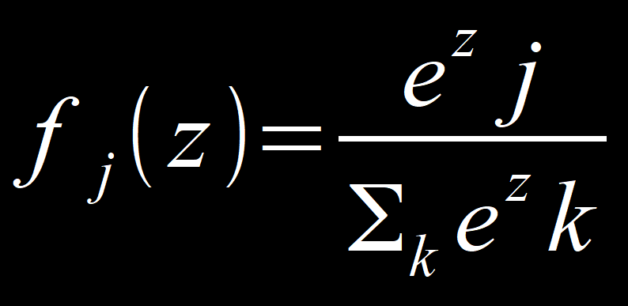

# **Experience replay**

### **Résumé du Deep Q-learning**

En Deep Q-learning, la partie _learning_ est vraiment séparée de la partie _acting_.  
La partie _learning_ fait une prédiction, la compare avec la dernière fois qu’elle a vue cette situation.  
La valeur de Q -> fonction de coût -> rétro-propagation -> les poids sont mis à jour, ainsi de suite.  
La partie _acting_, les valeurs Q1, Q2, Q3, … vont à la fonction ‘Softmax’ qui ressort une seule valeur.  
Le but de la fonction Softmax est de trouver un ‘trader’ entre l’exploitation et l’exploration, car, il y a plusieurs valeurs et il faut prendre la meilleure action, sauf que le problème est que l’IA peut prendre un chemin qu’elle connaît bien et n’explore pas toujours les moyens de gagner du temps. 

## À quoi sert l’experience replay ?

En deep Q-learning le réseau de neurones de convergent pas forcément, il prend énormément de temps, car, il faut énormément d’infos, d’entrées, actions pour pouvoir converger.  

L’**_experience replay_** permet à l’ANN de converger.

Et pour éviter que l’IA évite d’explorer les solutions qu’elle ne connaît pas, il y a 3 solutions.  

1. Ɛ-greedy (Ɛ-cupide)  
Un `Ɛ` est choisi entre 0 et 1, c’est un pourcentage (exemple 10 %) donc 10 % du temps, la décision est aléatoire, ainsi, 90 % du temps, la meilleure décision est prise. 10 % d’exploration et 90 % d’exploitation.  
1. Ɛ-soft (inverse la signification d’Ɛ)  
Un Ɛ d 90% donne : 90 % d’exploitation et 10 % d’exploration.
3. la fonction Softmax  

    

Pour chaque neurone de sotie, il y a une valeur (z1=3 par ex. pour la probabilité que ce soit un chien et pour le cas ou c’est un chat, z2 0,5). L’exponentiel de 3 sera diviser par la somme de tous les z, ce qui donne exponentiel de 3 diviser par exponentiel de 3 diviser par 0,5. Ce qui donne une valeur entre 0 et 1 et permet de s’assurer (en faisant la somme de tous les fj(z) [les probabilités]) qu’on obtient 1.  
Softmax donne des valeurs sommées à 1. Et ça donne à chaque action Q un pourcentage de chance d’être choisi. Cela permet un trader idéal entre l’exploration et l’exploitation. 

___
> [Adaptive Ɛ-greedy Exloration in Reinforcement Learning Based on Value Differences](https://tokic.com/www/tokicm/publikationen/papers/AdaptiveEpsilonGreedyExploration.pdf "Exploration adaptative Ɛ-greedy dans l'apprentissage par renforcement basée sur les différences de valeur"), Michel Tokic (2010)