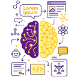

# **Prompt Engineering** </h1>

<!-- Ce domaine est étroitement lié à l’intelligence artificielle, particulièrement dans le contexte des intelligences artificielles génératives. -->

1. [Définition, origine est contexte](def)
2. [Est-il utiliser dans d’autres domaines ?](using)
3. [Les compétences requises](skills)
4. [Les mothode de prompting](types)
5. [Le ”`Gardege In , Gardage Out`”](gigo)