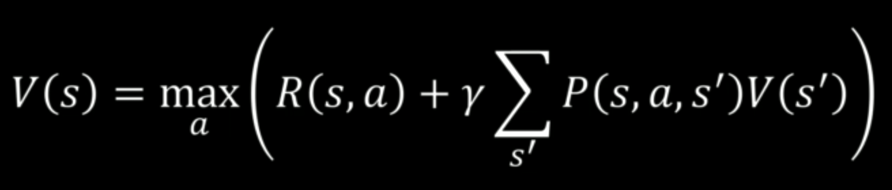

# **Pénalité de vie**
 

    

 

Dans la réalité, l’agent est récompensé au fur et à mesure de son avancée dans l’environnement.  

Afin de l’inciter à résoudre plus vite le casse-tête, chaque état à une récompense négative :
* À chaque fois que l’agent bouge, il est récompensé ;  
* Plus il reste dans le labyrinthe, plus il accumule les pénalités.  
* Plus la pénalité est élevée, plus vite l’agent va sortir.  

<h3 style="color:#d20800">Cala influence évidement les décisions plus un moins critiques ; <b>une pénalité trop forte pousse à finir plus vite et a prendre les pires décisions</b>.</h3>