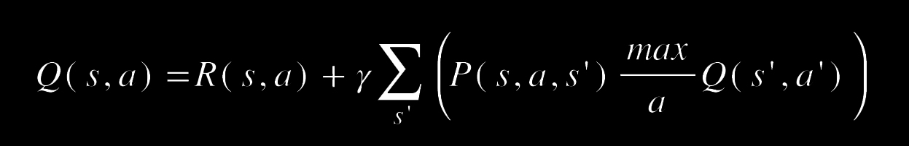
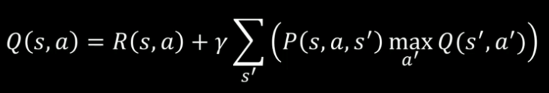

# **Q-learning Intuition**
 

    

 

## Pourquoi le Q-learning ?
Ici, l’agent ne regarde pas la valeur, mais qualité. Donc `Q` pour `Qualité` remplace `V` pour `Valeur`.  
L’approche Q-learning s’intéresse la valeur des états et des actions. Il y a un lien entre ces deux approches.  

Les `V`aleurs sont connues qui aide à calculer les `Q`ualités.  

> ➜ Ces deux approches sont différentes, bien qu’elles résolvent le même problème !  
Elles sont toutes les 2 valables et amènent au même résultat.  
Le raisonnement est un petit peu différent.  

Dans cette approche, l’agent calcul le Q(s,a) `(le Q de s et de a)`, à savoir la qualité de l’action `a` dans l’état `s`.  
Puis, l’agent obtient une récompense de prendre l’action dans l’état `R(s,a)`. _parce que l’agent à changer d’état._  
Et, il pourrait être aller à droite, à gauche, en haut ou en bas et l’agent dispose d’une mesure pour évaluer leur valeur. L’agent pondère la valeur de chaque état, par exemple : 80 % x la valeurde l’état du dessus, 10 % x la valeur de l’état de droite, … en utilisant le facteur de réduction gamma.

    

Le Q-learning consiste à prendre la meilleure action.  
___
Cette équation n’est pas récursive, car `Q` ne dépend pas d’autre `Q` mais de `V(s').`.  
`V(s').` reprend l’expression complète notée en haut, remplacé par l’expression `max a' Q(s',a')`

    

Donc, pour connaître la qualité de l’action dans l’état, l’agent s’appuie sur le calcul des qualités de prendre l’action `a'` s’il est dans l’état ‘s’’.
___
>>> cf.  
[Markov Decision Processes: Concepts ans Algorithms](https://www.semanticscholar.org/paper/Markov-Decision-Processes%3A-Concepts-and-Algorithms-Otterlo-Wiering/968bab782e52faf0f7957ca0f38b9e9078454afe?p2df)