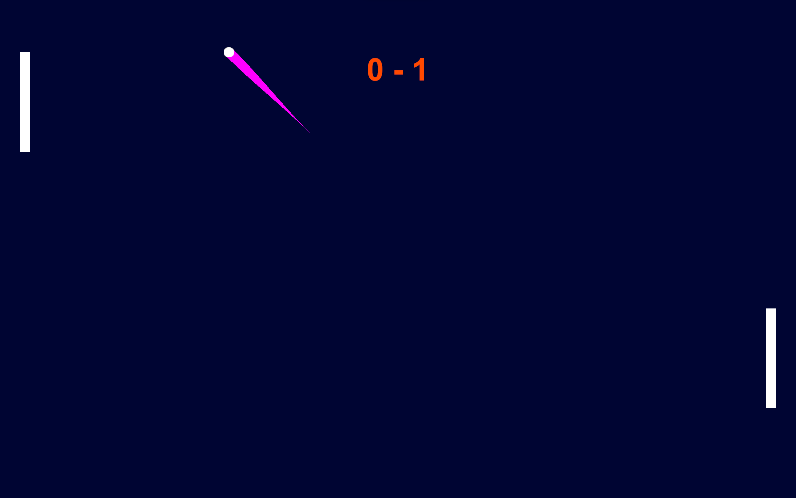

# Pong  

Ce jeu nécessite deux joueurs
* Celui de gauche est l'ordinateur
* Celui de droite est une personne

La bar se déplace avec les touches <kbd>˄</kbd> et <kbd>˅</kbd> ou un joystick.

L'écran tremble quand
* La balle entre en collision avec les murs
* La balle rebondit sur les paddles (tremble un peu)
* La balle un joueur perd (tremble fort)

Le score du joueur est à droite.

